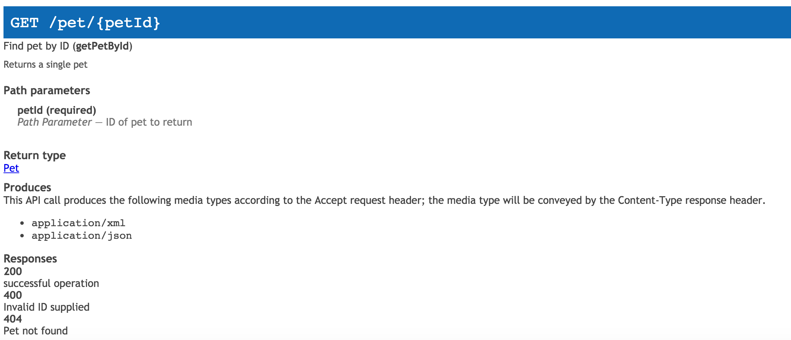
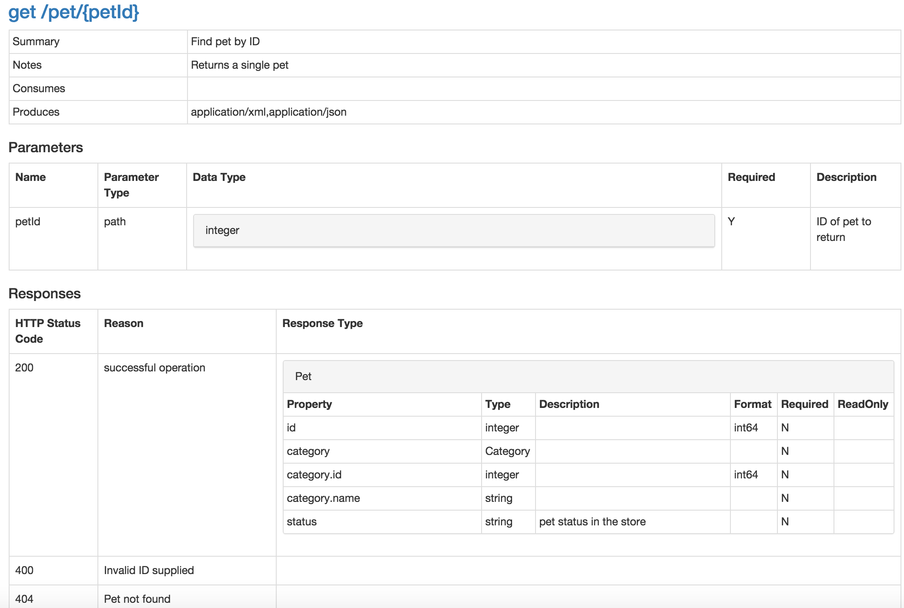

# swagger2html

Converts swagger jsons to html documents which are readable by everybody.
------

__Swagger-Codegen already has a tool to generate html documents. However, it seems ugly and in lack of information.__



------

__swagger2html produces a neat one:__



Check the full html [here](https://rawgit.com/chenjianjx/swagger2html/master/sample/petstore-by-s2h.html). 


# How to run

## Run as a command line tool

```bash
mvn clean package 
unzip target/swagger2html*jarset.zip -d /path/to/your/dir
cd /path/to/your/dir/swagger2html*
./s2h.sh http://petstore.swagger.io/v2/swagger.json /path/to/your/result/doc/file.html
# or s2h.bat for windows

```

## Run it inside your application

In your pom.xml, add the following: 

```xml

	<dependencies>
		...	
		<dependency>
			<groupId>com.github.chenjianjx</groupId>
			<artifactId>swagger2html</artifactId>
			<version>2.0.2</version>
		</dependency>
		...
	</dependencies>	

```


```java 
	Swagger2Html s2h = new Swagger2Html();
	Writer writer = new FileWriter("someFile.html");
	s2h.toHtml("http://petstore.swagger.io/v2/swagger.json", writer);
```

## Customization of CSS

```bash
./s2h.sh http://petstore.swagger.io/v2/swagger.json \ 
    /path/to/your/html/doc/file.html -css /path/to/your/css/with/html/tag.html");  
```
A css template can be found at [here](src/main/resources/css-to-include.html). It's not a css file but css snippets and/or external css links in an html file.


In java program, you can 

```java 
	String cssToInclude = FileUtils.toString("/path/to/your/css/with/html/tag.html");  
	Swagger2Html s2h = new Swagger2Html();
	s2h.toHtml("http://petstore.swagger.io/v2/swagger.json", cssToInclude , writer);
```  

